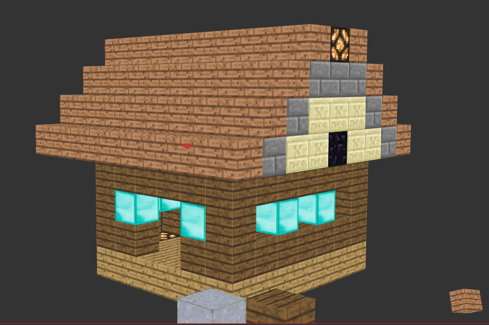

# Welcome to minecraft (on the web)!

### This is a funky project, application that allows to place and destroy block like minecraft, but in a **web browser**

<br>

### **Disclaimer!** - For some reason this works on chrome/chromium browsers only

<br>

# How to build

Install necessary dependencies
```
npm install
```

Compile with
```
npm run build:prod
```
After successful build your files wii be located in `dist` folder, have fun !

<br>

# Where to download build
 From the [tags](https://github.com/Storm-77/WebMinecraft/tags) section

<br>

# Look



<br>


